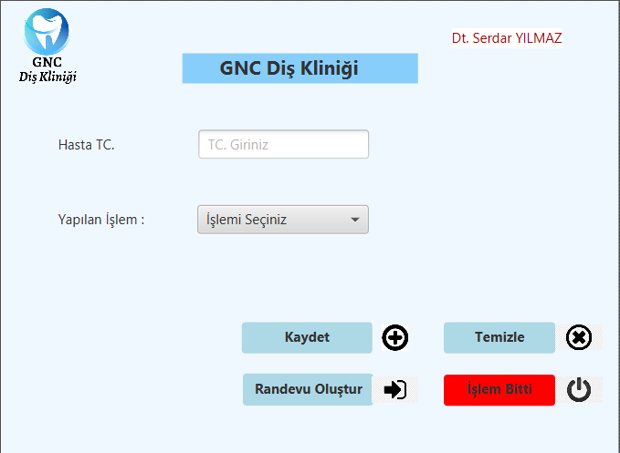
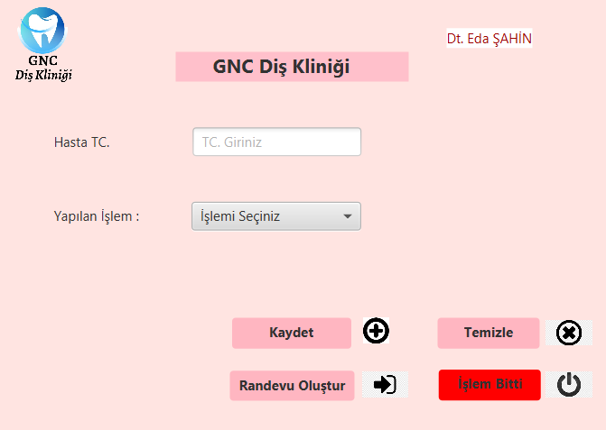
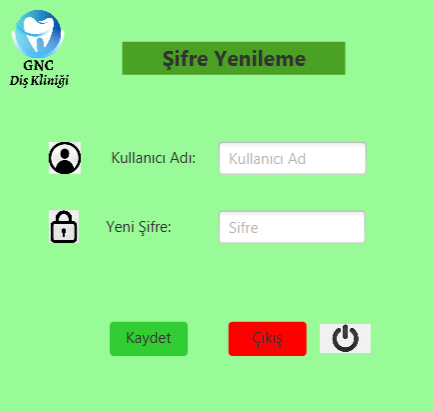
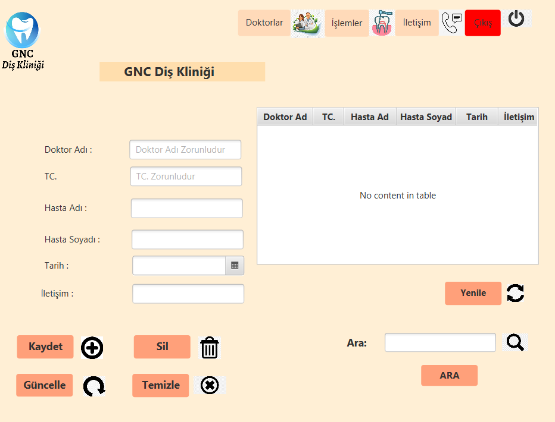

# dis_klinigi_otomasyonu

Diş Kliniği otomasyonunda 3 kullanıcı girişi mevcuttur. Bu girişler 2 doktor , 1 asistan girişinden oluşur.

Birinci doktor : "Diş Çekimi","Kanal Tedavisi","Diş Beyazlatma","İmplant Uygulama" işlemlerini yapar. 
Hastanın TC Kimlik numarasına göre yapmış olduğu işlemleri Db'e kaydeder, işlem bitmediyse randevu oluşturulması için asistan sayfasına yönlendirir ve asistan randevu oluşturur.
İşlem bittiyse çıkış yapar.

İkinci doktor : "Diş Teli (Başlangıç)","Diş Teli (Yenileme)","Diş Teli (Çıkarma)","Diş Çekimi" işlemlerini yapar. 
Hastanın TC Kimlik numarasına göre yapmış olduğu işlemleri Db'e kaydeder, işlem bitmediyse randevu oluşturulması için asistan sayfasına yönlendirir ve asistan randevu oluşturur.
İşlem bittiyse çıkış yapar.

Tüm kullanıcılar için şifre değiştirme işlemi yapılabiliyor.

Asistan :  Doktor Adı, TC. Hasta Adı, Hasta Soyadı, Tarih ve İletişim bilgilerini girerek randevu oluşturuyor.
  Kayıtlar üzerinde arama işlemi, güncelleme ve silme işlemi yapabiliyor.
  Doktorlar,işlemler ve iletişim bilgilerini görüntüleyebiliyor.

  

